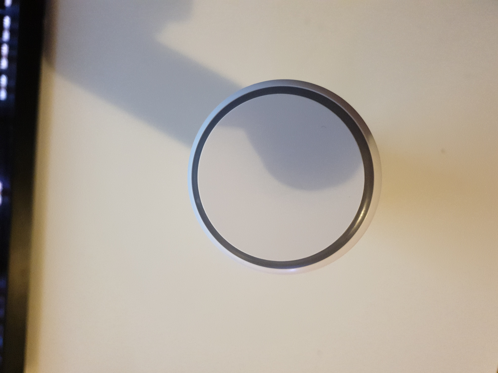
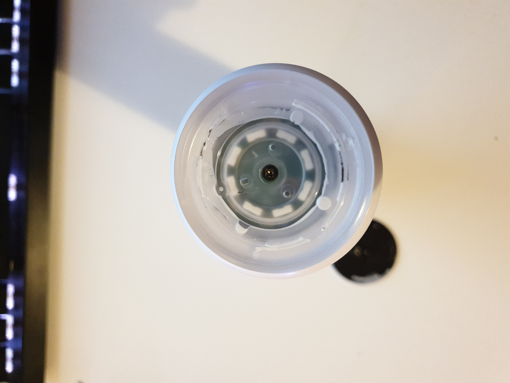
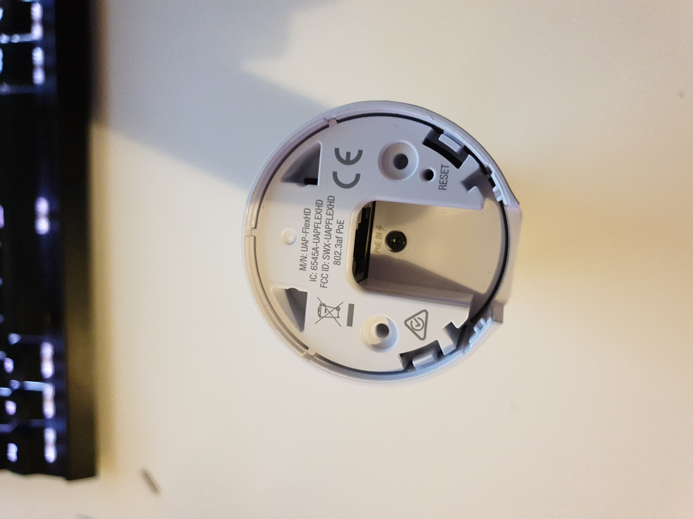
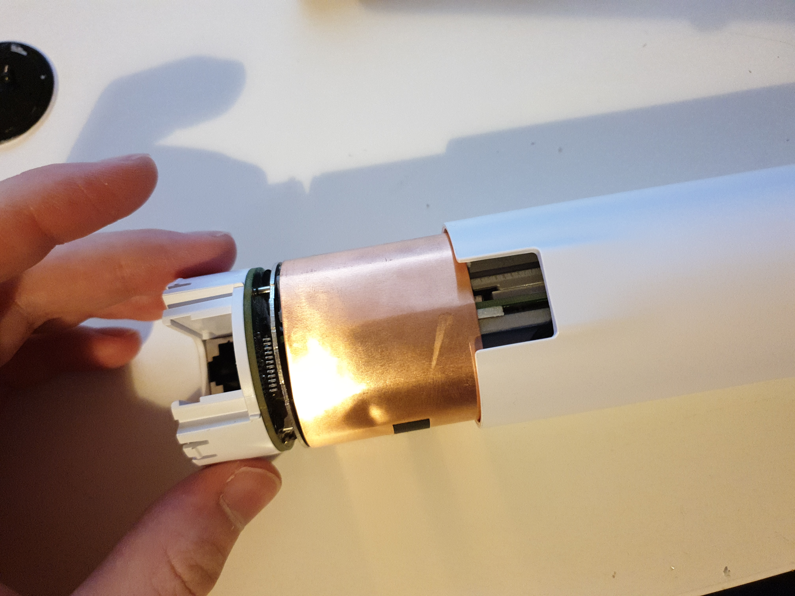
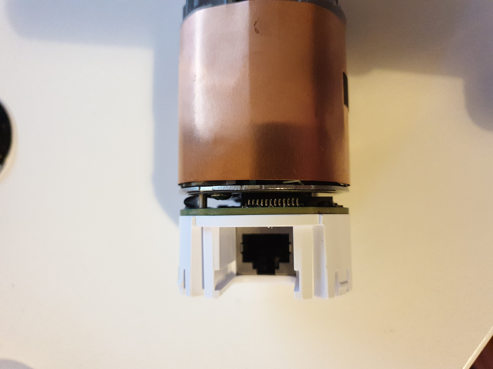
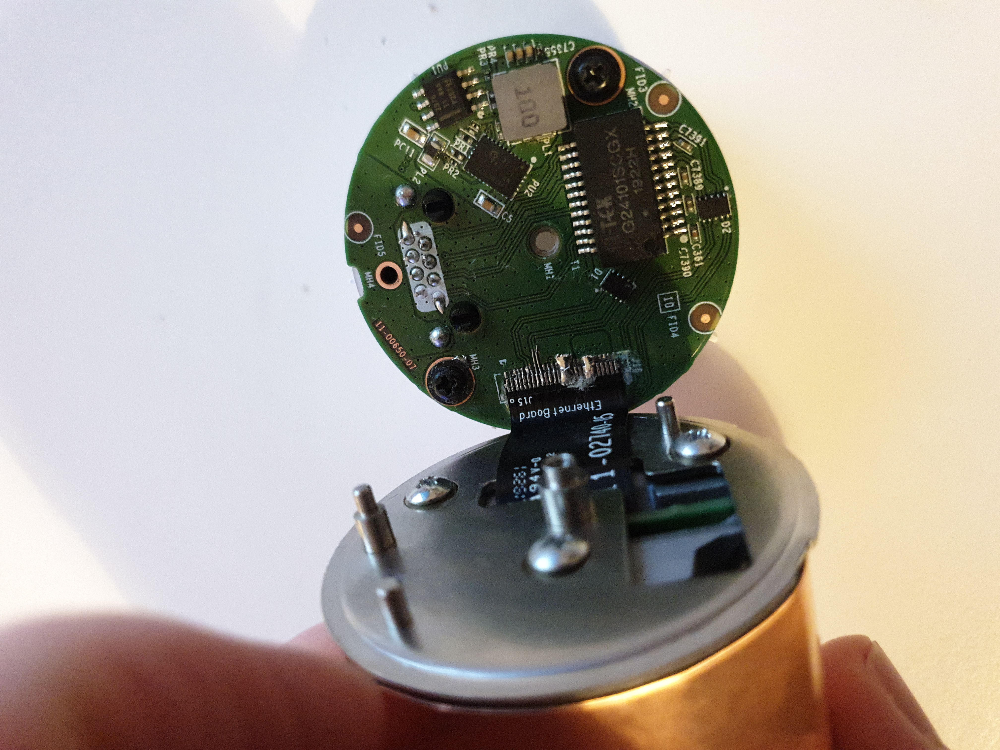
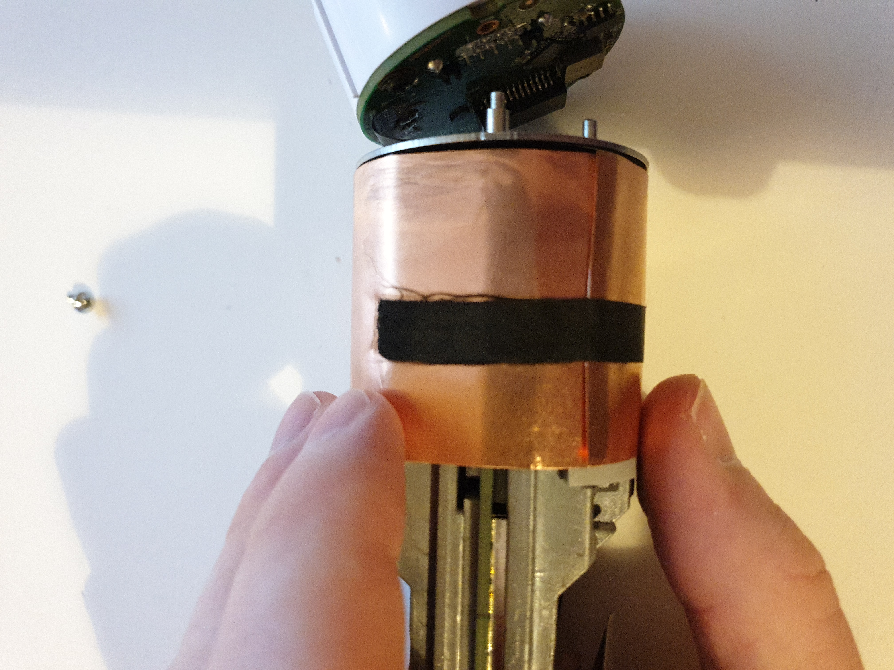
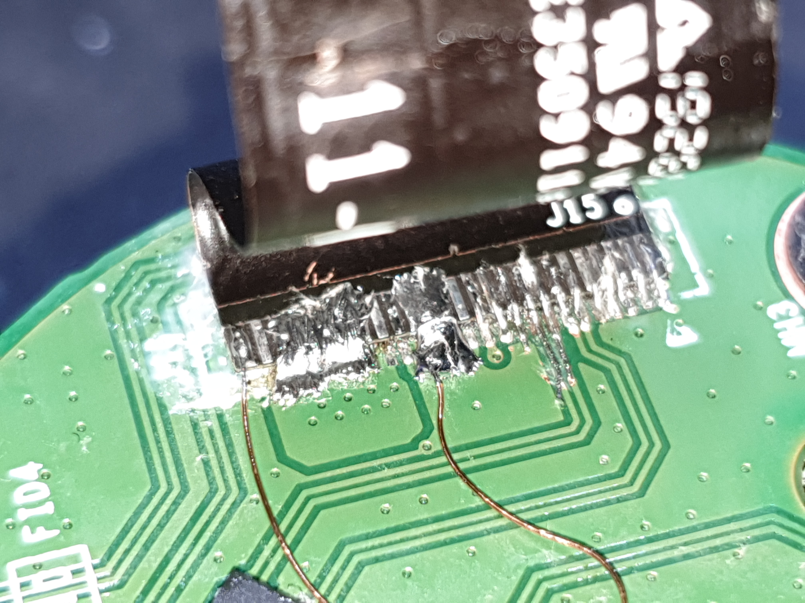

# Ubiquiti Unifi UAP FlexHD 
Dissasambly, Teardown and Repair. 
A look inside at least, maybe this is of help.

## The Top
The Top-cove with the Ubiquiti logo hides a screw beneeth it that holds the AP assambly inside the plastic enclosure.  
This screw has to be removed before the AP can be slid out of its enclosure.

## The Bottom

With the Screw in the middle in place, and the top screw removed, the latches on either side of the cutout for the LAN-cable, hold the assambly locked into the enclosure. 
If they hurt your fingers tweezing, you are doing something wrong. Sliding it out is pretty easy. 

### DO NOT remove the Screw since it holds the AP assambly together. 
Removal will damagae the AP when sliding it out of the enclosure. 

## AP Assambly
 
  
  
My shoddy solder-job is usually replaced with a nice latched connector that can now be un-latched for removal. 

## AP Ethernet-Board

## AP Mainboard

# Repair
Mine came half disassambled already and with a ripped connector.

